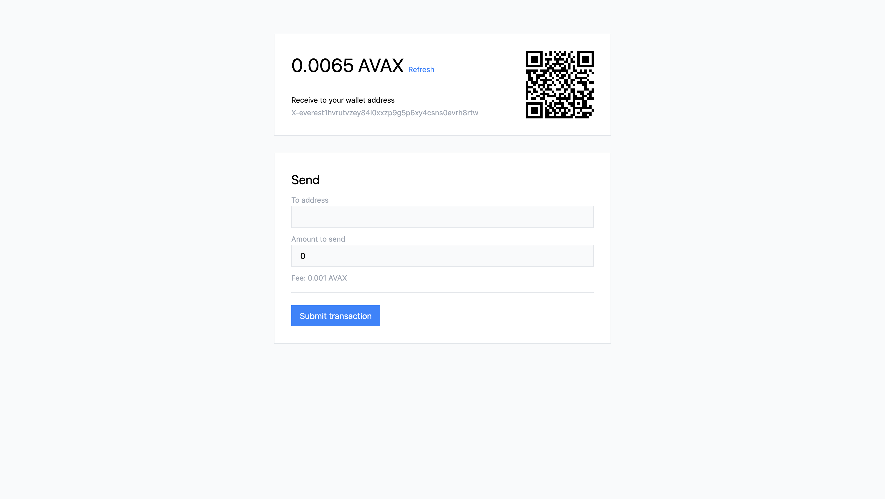

# avax-wallet

A simple client-side wallet for AVAX. [avax-wallet.jtormey.com](https://avax-wallet.jtormey.com)

## Features

* Generate a new wallet
* Load a wallet from an existing private key
* Store and manage wallet keys locally
* Receive AVAX
* Send AVAX to an address

## Development

* `yarn` - Install dependencies
* `yarn start` - Start the development server
* `yarn build` - Build the application
* `NODE_ENV="production" yarn build` - Build for production
